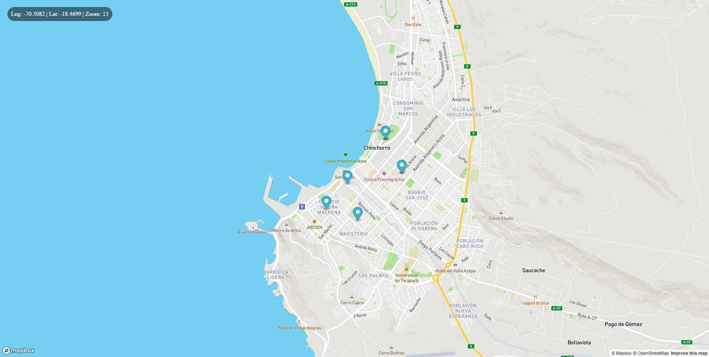

<div align="center">

</div>

## Ejecutar en desarrollo
1. Clonar el repositorio
2. Ejecutar
```
npm i
```
3. Clonar el archivo __.example.env__ y renombrar la copia a __.env__ 
4. llenar las variales de entorno en el ```.env```

<hr>
- <a href="https://github.com/bl0pez/mapa-backEnd">Link backEnd
